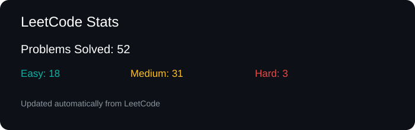

# Hi, I'm Sowmya 👋

### Computer Science Engineering Student | DSA | Software Development


I'm a 3rd-year Computer Science Engineering student interested in
Data Science, problem solving, and building practical projects.

- 🎓 CSE Student
- 🧠 Practicing DSA on LeetCode
- 🐍 Learning Python for ML
- 📊 Improving my SQL and data analysis skills
- 🚀 Building projects and participating in hackathons
---

## 🛠️ Tech Stack

### Languages
<p>
  
</p>

### Web & Backend
<p>
  
</p>

### Data & Tools
<p>
  
</p>

---

## 🧠 LeetCode

[](https://leetcode.com/u/SowmyaNKumar/)

<!-- LEETCODE-STATS:START -->



<!-- LEETCODE-STATS:END -->

---

## 🚀 My Projects

### 💼 SuperCRM
A CRM project focused on managing customer-related information and interactions.

🔗 [View Repository](https://github.com/Sowmya11082006/SuperCRM)

### 🍱 Homemade Food Portfolio
A portfolio website project created to showcase homemade food and related content.

🔗 [View Repository](https://github.com/Sowmya11082006/homemade-food-portfolio)

---

## 🤝 Collaborative Projects

### 🔬 Quantara
Contributed to a Hybrid Quantum Machine Learning project for early disease detection.

🔗 [View Repository](https://github.com/sofiya132/Quantara)

### 🔐 AI-Based Risk Authentication System
Collaborative project focused on risk-based authentication.

🔗 [View Repository](https://github.com/sofiya132/AI-Based-Risk-Auth-System)

### 💻 FlashHack
Collaborative hackathon/project repository.

🔗 [View Repository](https://github.com/supriyabulla/flashhack_75)

---

## 📊 GitHub

<p align="center">
  
</p>

<p align="center">
  
</p>

<p align="center">
  
</p>

---

## 📈 My Coding Journey

```text
DSA              █████░░░░░  Learning & Practicing
Python           ██████░░░░  Developing
SQL              █████░░░░░  Practicing
Web Development  █████░░░░░  Building Projects
